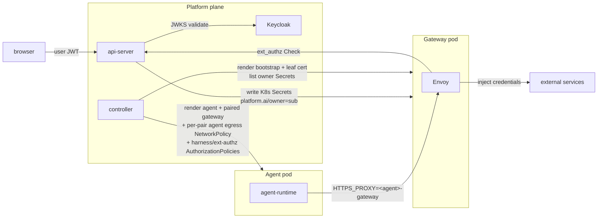

# Security and credentials

Last verified: 2026-05-22

## Motivated by

- [ADR-005 — Gateway pattern for credentials](../adrs/005-credential-gateway.md) — the agent never sees a real upstream token; a gateway injects them on the wire
- [ADR-015 — Multi-user authentication via Keycloak](../adrs/015-multi-user-auth.md) — Keycloak is the IdP; resources are owner-labelled
- [ADR-047 — API keys with scopes for headless CLI use](../adrs/047-api-keys-headless-auth.md) — long-lived owner-scoped credentials with three scopes (`agents:run`, `agents:manage`, `credentials:manage`); shares the bearer slot with Keycloak JWTs
- [ADR-018 — Slack integration](../adrs/018-slack-integration.md) — identity linking and the per-Agent `allowedUsers` gate that decides who can drive a thread
- [ADR-027 — Slack per-turn user impersonation](../adrs/027-slack-user-impersonation.md) — foreign repliers fork the Agent into a per-turn paired pod whose gateway mounts the replier's K8s credential Secrets
- [ADR-033 — Envoy-based credential gateway](../adrs/033-envoy-credential-gateway.md) — Envoy mints per-Agent leaf certs, MITMs egress, and injects credential headers
- [ADR-035 — HITL ext_authz](../adrs/035-unified-hitl-ux.md) — Envoy gates credentialed egress through an api-server ext_authz call
- [ADR-038 — Paired agent and gateway pods](../adrs/038-paired-gateway-pod.md) — agent and gateway run in two paired pods, with the credential boundary at the pod boundary
- [ADR-041 — Istio ambient mesh](../adrs/041-istio-ambient-mesh.md) — SPIFFE identity on the gateway-originated hops (harness, ext-authz); the gateway-admission AuthorizationPolicy is retired by ADR-042
- [ADR-042 — Agent egress is gated by NetworkPolicy; agent is not a mesh participant](../adrs/042-agent-egress-network-policy.md) — the agent → gateway hop is gated at the kernel by per-pair NetworkPolicy; the agent has no SPIFFE identity
- [ADR-046 — Eliminate Instance, collapse into Agent](../adrs/046-eliminate-instance.md) — per-Agent egress rules, allowed users, secret refs, and Envoy bootstrap all key on the Agent

## Overview

Three rules carry the security model:

1. **Agents never hold upstream credentials.** Real upstream tokens (GitHub,
   Anthropic, Slack, internal gateways) live in K8s Secrets labelled with the
   owner's `sub`. The Envoy proxy in the paired gateway pod injects them
   into outbound traffic on the wire — the agent pod never mounts Secret
   bytes.
2. **Identity flows from Keycloak.** Browser users authenticate against
   Keycloak; the api-server validates the JWT and stamps `platform.ai/owner` on
   every resource the user creates. Per-user credential isolation is the
   `platform.ai/owner` label on the K8s Secret — the controller's selector
   refuses to mount any other owner's Secret into a given owner's gateway pod.
3. **Two boundaries, layered.** The agent → gateway hop is gated at the
   *kernel* by a per-pair NetworkPolicy ([ADR-042](../adrs/042-agent-egress-network-policy.md));
   the gateway → api-server hops (harness and ext-authz) are gated at
   the *mesh* by per-Agent Istio AuthorizationPolicies on the
   gateway pod's SPIFFE principal ([ADR-041](../adrs/041-istio-ambient-mesh.md)).
   The agent pod opts out of ambient mesh (`istio.io/dataplane-mode:
   none`) so the kernel sees real destinations rather than HBONE
   tunnelled to ztunnel; its only admitted intra-cluster destination
   is the paired gateway pod on the Envoy proxy port. The gateway pod
   stays in ambient; istiod stamps it with a SPIFFE workload cert whose
   SA name equals the Agent (or fork) name. Two per-Agent
   AuthorizationPolicies enforce the gateway-originated boundary
   cryptographically: the api-server's harness waypoint ALLOWs the
   gateway principal to `/api/agents/<id>/*`; the per-Agent
   ext-authz Service ALLOWs only the matching SA. Fork pairs (ADR-027)
   get their **own** per-fork SA — distinct from the parent's — so a
   compromised fork can't impersonate the parent on the harness path;
   per-fork policies layer narrowly on top, admitting the fork's
   gateway SA only to `/api/agents/<parent>/mcp` and to the
   parent's ext-authz Service.

Workspace contents are explicitly outside the trust boundary — see the
security note on [persistence](persistence.md).

## Diagram

The credential boundary is the pod: K8s Secrets are mounted into the
gateway pod only, and the agent pod has no admitted route to TCP 80/443
other than its paired gateway. Enforcement is layered:

- **Per-pair agent egress NetworkPolicy** (controller-rendered,
  `<id>-agent-egress`) is the sole gate on the agent → paired gateway
  hop ([ADR-042](../adrs/042-agent-egress-network-policy.md)). The
  agent pod opts out of ambient mesh, so the kernel sees real
  destination IPs rather than HBONE tunnelled to ztunnel; the policy
  admits exactly DNS and the paired gateway pod's Envoy port. HBONE
  15008 is not admitted — the agent never speaks it.
- **Gateway Envoy ext_authz** (ADR-035) gates everything the gateway
  forwards on behalf of the agent — external upstreams via the HITL
  rule model, and the harness path is special-cased to pass through.
  This is the destination-side egress gate; no NetworkPolicies on
  Postgres / Redis / Keycloak / the harness or ext-authz Services are
  needed because the agent has no admitted route to any of them.
- **Mesh AuthorizationPolicy** (ADR-041) gates the gateway-originated
  hops by the gateway pod's SPIFFE principal: harness via the
  api-server's waypoint, ext-authz on the per-Agent Service. The
  agent has no SPIFFE identity in this model.

The agent pod has no service account token
(`automountServiceAccountToken: false`), and there is no co-located
sidecar to share a network or PID namespace with. See
[ADR-033 §Threat Model](../adrs/033-envoy-credential-gateway.md#threat-model)
and [ADR-038 §Threat Model](../adrs/038-paired-gateway-pod.md#threat-model).

## Identity

**Keycloak** is the only identity authority. It runs in-cluster as a Helm
subchart and is the OIDC provider for every authenticated surface. The
user agent flow:

1. Browser authenticates against Keycloak and obtains a JWT with audience
   `platform-api`.
2. UI sends the JWT to the api-server on every tRPC and ACP call. The
   api-server validates it against Keycloak's JWKS.
3. The api-server's `sub` claim becomes `platform.ai/owner=` on every
   resource the user creates (Agent ConfigMap, K8s credential Secret,
   etc.).

There is no token exchange — credential storage is K8s-native and label-
scoped, so the api-server enforces ownership directly when reading and
writing.

For headless / CI use, the CLI accepts a long-lived **API key** in the
same `Authorization: Bearer` slot, distinguished by a `pk_` prefix
([ADR-047](../adrs/047-api-keys-headless-auth.md)). API keys carry the
owner's `sub`, a subset of permission scopes, and an optional agent
allowlist; the bearer middleware dispatches by prefix and produces the
same downstream authenticated-principal shape — sub, scopes, agent
binding, and an optional key id. API keys cannot mint or revoke other
API keys — the management surface rejects any request whose principal
was authenticated via a key, so exfiltrated keys cannot escalate.

## Resource ownership

Multi-tenancy is **soft** — a single Kubernetes namespace, with a
`platform.ai/owner` label on every owned resource carrying the authenticated
user's `sub`. The api-server is the sole writer of `spec.yaml` and stamps
the label on create; every list and get filters by it. There is no
namespace-per-user.

The controller picks credentials per-Agent by listing K8s Secrets
labelled `platform.ai/owner=,platform.ai/managed-by=api-server` in the agent
namespace, then mounting the matching set into the paired gateway pod. Cross-
owner leakage is structurally prevented by the label selector — a missing
`platform.ai/owner` label is treated as no owner and never mounted.

## Credential storage

Each connected service produces one K8s Secret per `(owner, connection)`:

- **OAuth-issued tokens** (GitHub, MCP servers, Generic OAuth apps) — the
  api-server's `/api/oauth/callback` writes the access + refresh token
  pair plus a structured **host list** describing every wire position
  the token should be injected on. The refresh-token loop re-mints
  access tokens before expiry; the agent never sees the refresh token.
- **User-supplied secrets** (Anthropic API keys, generic API tokens) —
  the secrets module writes them with the same labels and annotations.
- **GitHub personal access tokens** — one PAT is *two* `generic` Secrets
  that share a display name. The `api.github.com` half stores the raw
  PAT, injects `Authorization: Bearer {value}`, and projects `GH_TOKEN`
  into the agent pod's env for the `gh` CLI. The `github.com` half
  stores `base64("x-access-token:" + PAT)` and injects
  `Authorization: Basic {value}` for `git clone` over HTTPS. Both
  halves are written atomically via `secrets.createGithubPat` (the
  mutation owns the base64 wrapping so callers send `{name, token}`
  only and a partial-create rolls back the api half if the git half
  fails). Picker UIs group the pair client-side by display name and
  hide orphans (one host missing).

**Multi-host connections.** A single OAuth connection can inject the
same token on more than one host with **different auth schemes per
host**, all from one K8s Secret. The Secret carries a JSON
`platform.ai/injection-hosts` annotation listing each
`{host, headerName?, valueFormat?, encoding?, pathPattern?}` tuple; the
controller fans the Secret into one Envoy filter chain per entry,
mounting the Secret once and reading a per-host SDS file
(`host-<sha8>.sds.yaml`) inside it per chain. The same list drives the
egress allowlist (one `connection:<id>` rule per host) — there is no
second source of truth.

GitHub.com is the motivating case ([issue #219](https://github.com/dam-agents/dam/issues/219)):
the same OAuth token must reach `api.github.com` as
`Authorization: Bearer …`, `github.com` as
`Authorization: Basic base64("x-access-token:<token>")` (so `git clone`
of private repos works without a credential helper), and
`raw.githubusercontent.com` as `Bearer` again (raw-file fetches).

The Secret carries the SDS YAML Envoy reads via its `path_config_source`.
Only the gateway pod mounts the Secret; the agent pod does not. See
[`packages/api-server/src/modules/connections/infrastructure/k8s-connections-port.ts`](../../packages/api-server/src/modules/connections/infrastructure/k8s-connections-port.ts) and
[`packages/api-server/src/modules/secrets/infrastructure/k8s-secrets-port.ts`](../../packages/api-server/src/modules/secrets/infrastructure/k8s-secrets-port.ts).

## Envoy credential injection

The controller renders a per-Agent `Envoy bootstrap ConfigMap` and a
cert-manager `Certificate` whose Secret holds the leaf TLS material the
gateway pod uses to terminate the agent's egress TLS. The leaf is
issued by a chart-managed `platform-mitm-ca-issuer` ClusterIssuer; the CA
cert is mounted into the agent at `/etc/platform/ca/ca.crt` (single-key
projection, `tls.key` stays in the gateway pod) so the agent's TLS
clients trust Envoy's intercept cert.

On the wire:

1. Agent sets `HTTPS_PROXY=http://<agent>-gateway:<envoyPort>`. The
   per-Agent gateway Service routes the connection to the paired
   gateway pod; every egress arrives there as HTTP CONNECT.
2. Envoy's outer listener (bound on `0.0.0.0`, reach gated by
   NetworkPolicy) terminates the CONNECT and routes the inner stream
   into an internal listener that reads SNI.
3. Per-host filter chains terminate TLS with the leaf cert, run the
   credential injector(s) to add the configured header(s) (or rewrite
   `?<param>=<value>` into the URL — see below), then forward to a
   per-chain `STRICT_DNS` cluster pinned to the host (explicit upstream
   SNI + SAN-bound TLS validation). The agent's inner `Host` header has
   no influence on the upstream destination — the route-confusion
   exfiltration path from
   [ADR-033 §Threat Model](../adrs/033-envoy-credential-gateway.md#threat-model)
   is structurally closed. Allow-only chains (path-rule promoted, no
   credential) keep using the dynamic forward proxy — they have no
   credential to misroute.
4. The default chain (SNI miss) does TCP passthrough — the request reaches
   the upstream unchanged.

Hosts the api-server has issued a credential for surface as L7 chains (SNI
match, header injection); hosts with no credential surface as L4
passthrough chains.

**Multiple injection steps per host.** A single host can carry more than
one credential — either two different credentials (e.g. an API key and a
tenant ID on distinct headers) or the same credential injected into both
a header and a URL query parameter (e.g. Bob shell's `/key/info?key=…`
endpoint). The controller groups Secrets by `hostPattern` into one L7
chain with an ordered list of `credential_injector` filters; each step
must use a unique header name, and steps marked with `queryParamName`
get a follow-up Lua filter that moves the (bare, percent-encoded) value
into the named URL query parameter and strips the carrier header so it
never reaches the upstream. See
[ADR-033 §Credential injection](../adrs/033-envoy-credential-gateway.md#credential-injection).

## HITL ext_authz

Each credentialed request goes through an ext_authz Check call against
the api-server. ADR-041: identity is the **per-Agent ext-authz
Service** the gateway pod's Envoy was configured to dial
(`<release>-extauthz-<id>`); the AuthorizationPolicy on each Service
ALLOWs only the matching SA principal, so by the time a Check arrives
the calling Agent is already proven cryptographically. The handler
parses the Agent ID from the gRPC `:authority`, looks up the matching
egress rule, and either allows the request, denies it, or holds it open
while the user makes a verdict in the inbox (ADR-035).
`failure_mode_allow: false` — a blocked Check fails closed: agent gets
403, no inbox prompt. The pod-IP resolver and the `x-platform-agent`
header are gone.

The HTTP filter on TLS-terminated chains sees method/path; the network
filter on the catch-all chain sees SNI only.

## Per-turn fork pods (Slack foreign replier)

When a user other than the Agent owner replies in a Slack thread,
the api-server emits a fork ConfigMap that the controller materialises
into a per-turn paired pod set: a fork agent Job and a fork gateway Pod
(ADR-038). The fork's gateway pod mounts the **replier's** K8s credential
Secrets — selected by `platform.ai/owner=<replier-sub>`, not the Agent
owner's `sub`. The credential boundary is preserved: the fork pair runs
the replier's credentials, never the parent Agent owner's. The fork
agent's `agent-platform.ai/agent` label still points at the parent
Agent so traffic resolves under the parent's egress rules; the fork's
own pair key (`agent-platform.ai/pair`) isolates it from the parent
Agent's pair. See [ADR-027](../adrs/027-slack-user-impersonation.md)
and [ADR-038](../adrs/038-paired-gateway-pod.md).

## Intra-cluster identity and admission

The agent and the gateway are gated by different mechanisms — they live
on opposite sides of the credential boundary, so the threat models
differ:

- **Per-Agent ServiceAccount** in the agent namespace, name ==
  Agent ID. Both pods of the long-lived pair run as this SA, but
  only the *gateway* pod is a mesh participant — istiod stamps it with
  a SPIFFE workload cert. The agent pod opts out of ambient
  (`istio.io/dataplane-mode: none`) and carries no SPIFFE identity.
  Fork pairs (ADR-027) get their **own** per-fork SA — distinct from
  the parent's — paired with narrow per-fork AuthorizationPolicies, so
  a compromised fork cannot reach the parent's full
  `/api/agents/<parent>/*` surface. `automountServiceAccountToken`
  stays false on both pods; the gateway's SPIFFE cert is independent
  of SA-token mounts.
- **Agent → paired gateway** is gated at the kernel by the per-pair
  `<id>-agent-egress` NetworkPolicy. Three egress rules: DNS to
  `kube-system` on UDP/TCP 53 (upstream Kubernetes), DNS to
  `openshift-dns` on UDP/TCP 5353 (OpenShift's `dns-default` pods
  listen on 5353 and NetworkPolicy evaluates pod port after
  kube-proxy translation), and the paired gateway pod (`pair=<id>,
  role=gateway`) on the Envoy proxy port. A cluster runs cluster DNS
  in only one of those namespaces; the unused rule is harmless. HBONE
  15008 is not admitted; the agent has no ztunnel and never speaks
  HBONE. Pair pinning is structural — the policy's pod-selector is
  the gateway pod itself, so a compromised agent has no admitted
  IP-and-port combination to reach anything else in the cluster.
- **Gateway → api-server harness.** All agent egress (including the
  harness call) flows through the paired gateway pod's Envoy, so what
  reaches the mesh is gateway → harness. The harness Service is
  `<rel>-apiserver-harness`, carrying `istio.io/use-waypoint`; Istio
  synthesises a waypoint Gateway pod in front of it. A per-Agent
  AuthorizationPolicy on the waypoint ALLOWs the gateway's SA
  principal to `/api/agents/<id>/*`; handlers can treat URL `:id`
  as authenticated. For forks, an additional per-fork policy admits
  the fork *gateway*'s SA only to `/api/agents/<parent>/mcp` —
  pod-files SSE and `/internal/trigger` stay parent-only.
- **Gateway → api-server ext-authz** routes through a per-Agent
  Service `<rel>-extauthz-<id>` rendered by the controller alongside
  each Agent. The AuthorizationPolicy on each Service ALLOWs only
  the matching SA principal (plus per-fork ALLOWs that admit fork
  SAs to the parent's Service so the parent owner's HITL rules stay
  the gate). The destination Service is cryptographically pinned to
  the calling Agent; the api-server derives Agent ID from the
  gRPC `:authority`.
- **Pod-level DENY AuthorizationPolicy** on the api-server pod rejects
  anything that isn't either the waypoint's SA (harness) or a
  per-Agent SA from the agent namespace (ext-authz), closing the
  direct pod-IP bypass.

NetworkPolicy is the security boundary for the agent's egress; mesh
AuthorizationPolicy is the security boundary for the gateway's egress
to api-server endpoints. Each pod's gate matches its threat model:
the agent runs untrusted code and is held at the kernel layer; the
gateway is platform-controlled and its identity flows through the
mesh.

## Dev cluster: SVID rotation resilience

A dev-cluster constraint, not an architectural property. The local
k3s/lima `cluster:install` ([`deploy/tasks.toml`](../../deploy/tasks.toml))
pins `DEFAULT_WORKLOAD_CERT_TTL=720h` on istiod so workload SVIDs
outlive a typical dev cluster's lifetime, and installs a
`ztunnel-cert-watchdog` CronJob in `istio-system` that scans recent
ztunnel logs every 10 min and rolls `ds/ztunnel` if it sees
`certificate expired` / `AlertReceived(CertificateExpired)`. Together
these absorb the race where lima VM suspend/resume on a sleeping host
laptop slips past the default 24h rotation window and stalls every
mesh hop — see [issue #283](https://github.com/dam-agents/dam/issues/283).
Production deployments configure mesh PKI separately and don't get
either knob.
